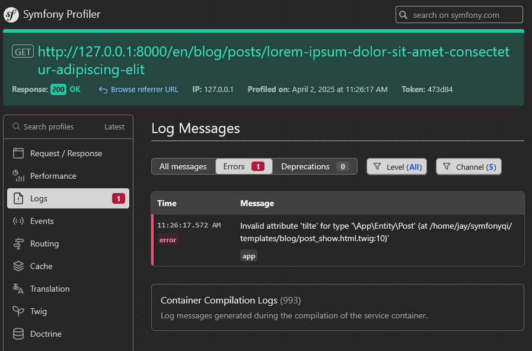

# TwigQI: Static code analysis for Twig templates

[](https://github.com/alisqi/TwigQI/blob/main/LICENSE)
[](https://php.net)

[](https://github.com/alisqi/TwigQI/actions)
[](https://codecov.io/gh/alisqi/TwigQI)

Twig Quality Inspections is an extension to the [Twig templating](https://github.com/twigphp/Twig) engine
which adds static analysis (i.e., compile-time) inspections and runtime assertions to increase templates' quality.
See the [inspections section](#Inspections) below for details.


The two intended use cases are:
* Add the extension to the `Twig\Environment` during development
* Invoke a CLI command in CI and/or pre-commit hook which compiles all templates with the extension enabled.

# Justification
Just in case you need convincing, please consider the following example:

```twig

  {{ user.name }}
  
     {# Oops #}
      (admin)
    
      ({{ user.getRoleLabel(usr.role) }}) {# Uh oh! #}
    
  

```

Here, `usr.admin` is obviously a typo. Fortunately, this bug is easily detected with `strict_types` enabled,
but only if the macro is called with `showBadge=true`. In this example, the `(admin)` badge will simply never be printed in production
(where `strict_types` is likely disabled).

However, `user.getRoleLabel(usr.role)` will cause an uncaught `TypeError` if that method's parameter is not nullable,
since Twig will call that method with `null`. Instead of just having a buggy badge, *the whole page breaks*.

# Installation
First, install using
```bash
composer require --dev alisqi/twigqi
```

## Symfony integration
In a Symfony application, the recommended way is to create a class that extends `AlisQI\TwigQI\Extension` and add the `When` attribute.
This allows you to configure which inspections to enable.

```php
// src/Twig/TwigQIExtension.php
<?php

namespace App\Twig;

use AlisQI\TwigQI\Extension;
use Symfony\Component\DependencyInjection\Attribute\When;

#[When('dev')]
final class TwigQIExtension extends AbstractExtension
{
    public function getNodeVisitors(): array
    {
        return [
            // Assertions:
            new WrapTypesInAssertedTypes(),

            // Inspections:
            // new BadArgumentCountInMacroCall(), // Kills the Web Debug Toolbar: https://github.com/alisqi/TwigQI/issues/3#issuecomment-2651503912
            new InvalidConstant(),
            new InvalidDotOperation(),
            new InvalidTypes(),
            new PositionalMacroArgumentAfterNamed(),
            new RequiredMacroArgumentAfterOptional(),
            // new UndeclaredVariableInMacro(), // Kills the Web Debug Toolbar: https://github.com/alisqi/TwigQI/issues/3#issuecomment-2651503912
        ];
    }
}
```

Alternatively, if you want *all* inspections, you can enable the extension in your `config/services.yaml`:

```yaml
when@dev:
    services:
        AlisQI\TwigQI\Extension:
            autowire: true
            tags: [ 'twig.extension' ]
```

### Output & Logging
Either way, all inspection results will [show up](docs/error-on-page.png) in the Web Debug Toolbar's logs.



This example is based on the [Symfony demo application](https://github.com/symfony/demo), where
`src/templates/blog/post_show.html.twig` was amended to include the following in the `main` block:
```twig

 {# to demonstrate static typing during template compilation #}
    {{ post.tilte }}

```

## Non-Symfony projects
You can also add the extension manually to your `Twig\Environment`:
```php
$twig->addExtension(new AlisQI\TwigQI\Extension($logger));
```

## Configuration

### Logging
The extension class requires a `\Psr\Log\LoggerInterface` implementation.

This package includes the `TriggerErrorLogger` class, which reports issues using PHP's `trigger_error()`
with appropriate `E_USER_*` levels.

# Design
The current design uses `NodeVisitor` classes for every inspection. That allows for easy testing and configurability.

The level of error (error, warning, notice) depends entirely on the authors' opinions on code quality. `LogLevel::ERROR`
is used for, well, errors, that the author(s) deem actual errors in code. `LogLevel::WARNING` is used for more
opinionated issues, such as relying on macro arguments always being optional.

## Typing system and syntax
Many inspections rely on proper typing. However, the [documentation for the `types` tag](https://twig.symfony.com/doc/3.x/tags/types.html)
explicitly avoids specifying the syntax or contents of types.

So how should developers declare types? While PHP developers are often familiar with PHPStan, Twig template designers
may instead be used to TypeScript.

The [Twig documentation](https://twig.symfony.com/doc/3.x/templates.html#variables) sums up its stance succinctly:

> Twig tries to abstract PHP types as much as possible and works with a few basic types[.]

Therefore, TwigQI uses the basic types described by Twig, while defining syntax for iterables. The goal is to have a
*simple* type system that's easy to learn and use, and which should cover the vast majority of use cases.

Your preferences and/or requirements may very well differ.

Here's the list of types supported by TwigQI:
* Scalar: `string`, `number`, `boolean`, `null`, `object` (although a class is preferred)
* Classes, interfaces and traits

  Use FQNs with a starting backslash. Note that backslashes must be escaped in Twig strings [until v4](https://github.com/twigphp/Twig/pull/4199).
* Three types of iterables, with increasing specificity
  * `iterable` declares nothing more or less than that the variable is iterable
  * `iterable<ValueType>` declares the values' type
  * `iterable<number, ValueType>` and `iterable<string, ValueType>` does the same for keys
  
  You can create recursive types: `iterable<string, iterable<number, iterable<string>>>`
* Lastly, `mixed` allows you to declare that a variable is defined without specifying a concrete type.

Any type can be prefixed with `?` to make it nullable.

Note that there's no dedicated syntax for iterables with particular, known keys. Nor can you declare that values have
different types. You could use one of the `iterable` variants (e.g., `iterable<string, mixed>`), but I would humbly
recommend using a `readonly class` to act as a view model.

# Inspections
Here's the list of inspections already considered relevant and feasible.

Those marked with ⌛ are planned / considered, while ✅ means the inspection is implemented.

Note that most of these could also be analyzed by PHPStan if it could properly understand (compiled) templates and how
they are rendered. This is the aim of a similar project: [TwigStan](https://github.com/twigstan/twigstan).

## Typed variables
* ✅ Declared types is invalid (e.g., ``)
* ✅ Runtime: non-optional variable is not defined
* ✅ Runtime: non-nullable variable is null
* ✅ Runtime: variable does not match type
* ✅ Invalid object property or method (e.g., `{{ user.nmae }}`)
  
  Types for keys and values in `for` loops are automatically derived from iterable types.

  ⚠️ This inspection _can_ trigger false positives, depending on your template logic.
* ⌛ Undeclared variable (i.e., missing in `types`, `set`, etc)

## Constants and enum cases
* ✅ Invalid constant (e.g., `constant('BAD')`)
* ✅ Expressions as first argument (e.g., `constant('UH' ~ 'OH')`)
 
  This is opinionated, as it can work perfectly fine
* ✅ Second argument (object) is not a name (e.g., `constant('CONST', {})`)
  
  This is opinionated, too: `constant('CONST', foo ?: bar)` can work fine

* ✅ Invalid enum case (e.g., `enum('\\Some\\Enum').InvalidCase`)

## Macros
While Twig considers all macro arguments optional (and provides `null` as a default), TwigQI considers arguments with
no explicit default value as required.

* ⌛ Arguments not declared using `types`
* ✅ Undefined variable used (arguments, ``, etc)
* ✅ Call with *too many* arguments (except if `varargs` is used)
* ✅ Call with *too few* arguments
* ✅ Required argument declared after optional
* ✅ Positional argument after named in call expression
* ⌛ Type mismatch in macro call

# Similar Projects

* [curlylint](https://www.curlylint.org/): Focuses on HTML
* [djLint](https://www.djlint.com/docs/linter/): Focuses on HTML

# Acknowledgments
Big thanks to [Ruud Kamphuis](https://github.com/ruudk) for [TwigStan](https://github.com/twigstan/twigstan),
and for helping on this very project.
